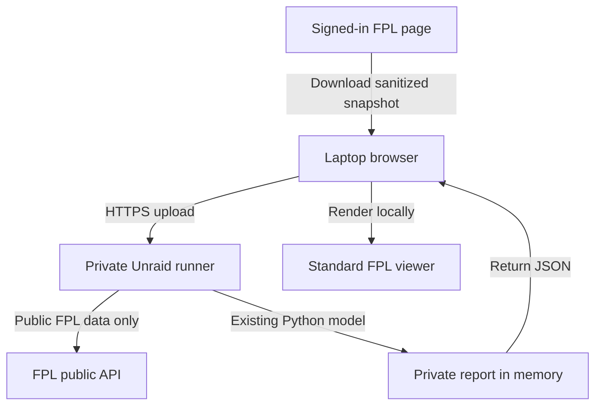

# Standard FPL Self-Hosted Runner

Last reviewed: 23 August 2026

## Decision

A small single-user service on the manager's own Unraid server is the best next personal-use path for removing the local Python requirement. It can reuse the existing Python analysis unchanged, while the laptop only needs a browser.

This is feasible as a separate Standard FPL service. It is not a substitute for Premier League permission, registered authentication or tenant isolation in a commercial product, and it must not be connected to the public Draft/H2H report pipeline.

## Implemented Slice 1

The LAN-only contract POC now lets the manager:

1. use the browser-local helper to download `standard-fpl-current-team.json`;
2. open the private runner from any browser on the trusted LAN;
3. paste the ordinary public Standard FPL entry URL;
4. choose the sanitized snapshot; and
5. receive and render the generated report in the same tab.

Python and the toolkit run only inside the container. The laptop no longer needs Python, repository access or a command line.

## Recommended personal architecture



The service is delivered through `Dockerfile.standard-fpl-runner` with the dedicated `fpl-toolkit-runner` entrypoint and web UI. The browser selects the sanitized snapshot, the server validates it before analysis, fetches only public FPL data, runs `collect_standard_fpl`, and returns the private report to the same browser session.

The first version retains neither the uploaded snapshot nor generated report after the response completes. It has no upload/report persistence, browser storage, analytics, user account or endpoint that changes an FPL team. Frozen outcome history can be added later as an explicit opt-in persistent volume once its retention and deletion behaviour are defined.

## Build and run on the trusted LAN

From a checkout of the repository on Unraid:

```bash
docker build -f Dockerfile.standard-fpl-runner -t fpl-standard-runner:local .
docker run --rm --name fpl-standard-runner \
  --read-only \
  --cap-drop ALL \
  --security-opt no-new-privileges \
  -p <UNRAID_LAN_IP>:8787:8787 \
  fpl-standard-runner:local
```

Replace `<UNRAID_LAN_IP>` with the server's private LAN address, then open `http://<UNRAID_LAN_IP>:8787`. Binding the published port to that private address reduces accidental exposure but is not authentication. Do not add router port forwarding or a public reverse-proxy route.

The container has no volume and runs as an unprivileged user. `GET /health` reports the service/model version and `ephemeral` storage mode without private data. Stop the container to remove the running service. Rebuild the local image from a reviewed repository version to upgrade; a managed Unraid template belongs to Slice 2.

## Trust boundaries

| Boundary | Personal runner rule |
|---|---|
| FPL login | Remains entirely on `fantasy.premierleague.com`; the runner never receives credentials, cookies or tokens. |
| Snapshot | Accept only `standard-fpl-private-snapshot-v1`, enforce size and exact-field validation, and reject identity or credential-shaped fields. |
| Network | Bind to the trusted LAN by default. Remote exposure requires HTTPS and an authentication layer such as the owner's reverse proxy or access gateway. |
| Storage | Process snapshot and report in memory for the first POC; do not log request bodies or report content. |
| Public APIs | Server-side requests are limited to the existing unauthenticated FPL endpoints used by `FantasyApiClient`. |
| FPL actions | Keep the runner read-only. It must never submit transfers, lineups, captaincy or chips. |
| Draft/H2H | Use a separate route, container entrypoint and private report type. Do not import it from the Draft collector or publish to `public/data/latest.json`. |

## Private API

The smallest useful service surface is:

| Method and route | Purpose |
|---|---|
| `GET /health` | Container and model-version health without private data. |
| `GET /` | Serve a private upload-and-report page derived from the current viewer. |
| `POST /api/standard-fpl/report` | Accept one sanitized snapshot plus the ordinary public entry URL and return one validated private report. |

The report endpoint uses `multipart/form-data`, enforces a 256 KB default body limit, rejects missing, duplicate and unexpected parts, applies short request/upstream timeouts and returns structured safe errors. It accepts only an ordinary `fantasy.premierleague.com` entry URL rather than a raw ID. The identifier is public model context and is not treated as authorization.

Responses use `no-store`, same-origin-only browser requests, a restrictive Content Security Policy and no CORS permission. Credential-shaped snapshot fields, identity-shaped report fields and unsupported HTTP write methods fail closed. Request bodies, entry URLs and reports are omitted from service logs.

## Authentication and exposure

For the first personal POC, the safest default is **LAN-only with no router port forwarding**. If remote access is wanted later, terminate HTTPS and authentication in the owner's existing reverse-proxy stack before the runner. A runner-specific secret or access policy protects the service itself; it does not authenticate to FPL.

Plex-style login is not a direct fit for Standard FPL. Plex can prove identity and library entitlement to Seerr because Plex controls that entitlement relationship. FPL does not provide the toolkit with an equivalent sanctioned entitlement check. A personal runner can use local identity, while a future commercial service needs its own account and entitlement system plus an approved FPL connection.

## Rejected shortcuts

- **Public GitHub Actions:** uploading a private squad to a workflow in a public repository creates unacceptable retention, logs and artifact risks.
- **Publishing the report to GitHub Pages:** team finances and transfer plans would become public or depend on obscurity rather than authorization.
- **Browser-only model rewrite:** porting the Python model to JavaScript would create a second calculation implementation and still leave cross-origin public-data constraints.
- **Reusing FPL cookies or OAuth client details:** this crosses the established credential and authorization boundary.
- **Mixing the service into the Draft collector:** a shared process or public report path would weaken the tested mode-isolation boundary.

## Implementation slices

### Slice 1: local contract POC — implemented

- add a Standard-only service module using the Python standard library or one narrowly justified web dependency;
- accept the strict snapshot contract and public entry URL;
- call the existing `collect_standard_fpl` function;
- return the report without persistence;
- add request-size, malformed-input, stale-Gameweek and forbidden-field tests; and
- add a container health check.

### Slice 2: Unraid usability — next

- publish an image and Unraid template;
- provide a browser upload page based on the current private viewer;
- show actionable validation and public-API errors;
- allow configuration through ordinary container variables; and
- document LAN-only installation, upgrades and rollback.

### Slice 3: optional private history

- persist only the minimum frozen decision/outcome state to a dedicated volume;
- define retention, deletion and backup behaviour;
- keep uploaded snapshots out of logs and long-term storage; and
- test recovery across container upgrades.

## Slice 1 acceptance status

- **Implemented:** a laptop with only a browser can turn `standard-fpl-current-team.json` into a rendered report.
- **Implemented:** the snapshot and report never enter the public repository, Pages report data or Draft collector.
- **Implemented and tested:** invalid, stale, oversized and credential-shaped uploads fail closed with a useful message.
- **Implemented:** the service makes no authenticated request to FPL and exposes no endpoint that changes an FPL team.
- **Implemented:** the initial container has no persistent volume; restarting removes all uploaded and generated private state.
- **Release gate:** the complete Draft/H2H regression suite must pass on every runner change.

## Feasibility and remaining choices

The model path remains shared: `collect_standard_fpl` now accepts validated private state in memory as well as the existing private-file CLI route. The runner uses the Python standard library for its HTTP boundary and keeps `requests` as the only external runtime dependency.

Before implementing remote access or persistence, the owner must choose whether the service remains LAN-only, sits behind an authenticated access gateway or is reachable only through a private VPN. The implemented Slice 1 stays local-network-only and ephemeral.
