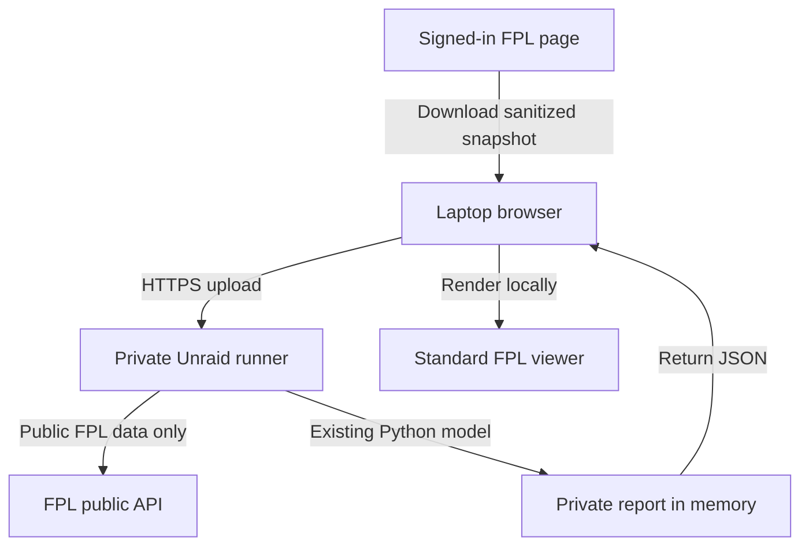

# Standard FPL Self-Hosted Runner Discovery

Last reviewed: 23 August 2026

## Decision

A small single-user service on the manager's own Unraid server is the best next personal-use path for removing the local Python requirement. It can reuse the existing Python analysis unchanged, while the laptop only needs a browser.

This is feasible as a separate Standard FPL service. It is not a substitute for Premier League permission, registered authentication or tenant isolation in a commercial product, and it must not be connected to the public Draft/H2H report pipeline.

## Current bottleneck

The implemented flow still requires the manager to:

1. use the browser-local helper to download `standard-fpl-current-team.json`;
2. move the file into the repository's gitignored private directory;
3. install Python 3.11 and the toolkit;
4. configure entry and snapshot environment variables;
5. run `fpl-toolkit --mode standard-fpl`; and
6. load the generated report into the browser-local viewer.

The helper and viewer are browser-accessible, but the analysis step is not. That is a practical blocker on a managed laptop where software installation is unavailable.

## Recommended personal architecture

The service should be delivered as a dedicated container with its own entrypoint and web UI. The browser selects the sanitized snapshot, the server validates it before analysis, fetches only public FPL data, runs `collect_standard_fpl`, and returns the private report to the same browser session.

The first version should retain neither the uploaded snapshot nor generated report after the response completes. Frozen outcome history can be added later as an explicit opt-in persistent volume once its retention and deletion behaviour are defined.

## Trust boundaries

| Boundary | Personal runner rule |
|---|---|
| FPL login | Remains entirely on `fantasy.premierleague.com`; the runner never receives credentials, cookies or tokens. |
| Snapshot | Accept only `standard-fpl-private-snapshot-v1`, enforce size and exact-field validation, and reject identity or credential-shaped fields. |
| Network | Bind to the trusted LAN by default. Remote exposure requires HTTPS and an authentication layer such as the owner's reverse proxy or access gateway. |
| Storage | Process snapshot and report in memory for the first POC; do not log request bodies or report content. |
| Public APIs | Server-side requests are limited to the existing unauthenticated FPL endpoints used by `FantasyApiClient`. |
| FPL actions | Keep the runner read-only. It must never submit transfers, lineups, captaincy or chips. |
| Draft/H2H | Use a separate route, container entrypoint and private report type. Do not import it from the Draft collector or publish to `public/data/latest.json`. |

## Proposed private API

The smallest useful service surface is:

| Method and route | Purpose |
|---|---|
| `GET /health` | Container and model-version health without private data. |
| `GET /` | Serve a private upload-and-report page derived from the current viewer. |
| `POST /api/standard-fpl/report` | Accept one sanitized snapshot plus the ordinary public entry URL and return one validated private report. |

The report endpoint should use `multipart/form-data`, enforce a small body limit, reject unexpected parts, set a short request timeout and return structured safe errors. It should not accept a raw entry ID alone as authorization; the identifier is merely public model context.

## Authentication and exposure

For the first personal POC, the safest default is **LAN-only with no router port forwarding**. If remote access is wanted later, terminate HTTPS and authentication in the owner's existing reverse-proxy stack before the runner. A runner-specific secret or access policy protects the service itself; it does not authenticate to FPL.

Plex-style login is not a direct fit for Standard FPL. Plex can prove identity and library entitlement to Seerr because Plex controls that entitlement relationship. FPL does not provide the toolkit with an equivalent sanctioned entitlement check. A personal runner can use local identity, while a future commercial service needs its own account and entitlement system plus an approved FPL connection.

## Rejected shortcuts

- **Public GitHub Actions:** uploading a private squad to a workflow in a public repository creates unacceptable retention, logs and artifact risks.
- **Publishing the report to GitHub Pages:** team finances and transfer plans would become public or depend on obscurity rather than authorization.
- **Browser-only model rewrite:** porting the Python model to JavaScript would create a second calculation implementation and still leave cross-origin public-data constraints.
- **Reusing FPL cookies or OAuth client details:** this crosses the established credential and authorization boundary.
- **Mixing the service into the Draft collector:** a shared process or public report path would weaken the tested mode-isolation boundary.

## Implementation slices

### Slice 1: local contract POC

- add a Standard-only service module using the Python standard library or one narrowly justified web dependency;
- accept the strict snapshot contract and public entry URL;
- call the existing `collect_standard_fpl` function;
- return the report without persistence;
- add request-size, malformed-input, stale-Gameweek and forbidden-field tests; and
- add a container health check.

### Slice 2: Unraid usability

- publish an image and Unraid template;
- provide a browser upload page based on the current private viewer;
- show actionable validation and public-API errors;
- allow configuration through ordinary container variables; and
- document LAN-only installation, upgrades and rollback.

### Slice 3: optional private history

- persist only the minimum frozen decision/outcome state to a dedicated volume;
- define retention, deletion and backup behaviour;
- keep uploaded snapshots out of logs and long-term storage; and
- test recovery across container upgrades.

## Acceptance criteria for Slice 1

- A laptop with only a browser can turn `standard-fpl-current-team.json` into a rendered report.
- The snapshot and report never enter the public repository, Pages assets or Draft collector.
- Invalid, stale, oversized and credential-shaped uploads fail closed with a useful message.
- The service makes no authenticated request to FPL and exposes no endpoint that changes an FPL team.
- Restarting the initial container removes all uploaded and generated private state.
- The existing full Draft/H2H regression suite remains unchanged and passes.

## Feasibility and remaining choices

The model path is low risk because `collect_standard_fpl` already accepts injected settings and uses only one external Python dependency (`requests`). The main work is the private HTTP boundary, container packaging and user-facing error handling, not rebuilding the calculations.

Before implementing remote access or persistence, the owner must choose whether the service is LAN-only, protected by the existing reverse proxy, or reachable through a private VPN. Slice 1 does not need that choice: it should default to local-network use and ephemeral state.

